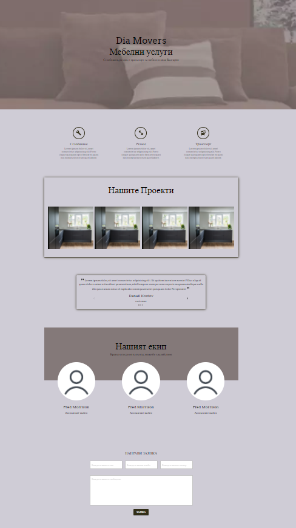

# Project Name
> Furniture Service Landing Page Website

## Table of contents
* [General info](#general-info)
* [Screenshots](#screenshots)
* [Technologies](#technologies)
* [Demo](#demo)
* [Features](#features)
* [Status](#status)
* [Contact](#contact)

## General info
The purpose of this website is to make quick overview of the services offered by the company. Аfter that we want the reader to have the motivation for order.
When i started to make this website my main motivation was that i made it for my first precious customer - my brother.

## Screenshots

## Technologies
* React JS - creact-react-app
* Material-UI
* Git

## Demo
https://brochure-furniture.netlify.app/

## Features
List of features ready and TODOs for future development
* My first real world form validation

To-do list:
* To Become E-commerce in future

## Status
Project is:  _finished_, for now

## Contact
Created by [@Dan](https://www.linkedin.com/in/danail-kostov-ba95b81b3/) - feel free to contact me!
